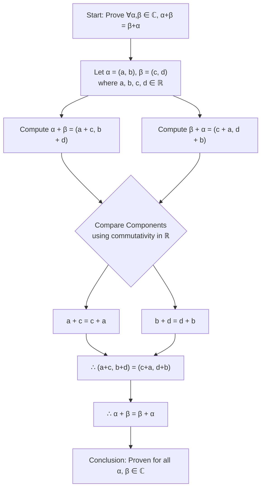

```json
{
  "problem_analysis": "The goal is to prove the commutative property of addition for the field of complex numbers, $\mathbb{C}$. This is a fundamental property that must hold for any field. The proof will leverage the definition of a complex number as an ordered pair of real numbers and the definition of complex addition, ultimately resting on the commutativity of addition for real numbers.",
  "key_concepts_and_theorems": [
    {
      "name": "Definition of a Complex Number",
      "statement": "A complex number $z$ is defined as an ordered pair of real numbers, $z = (a, b)$, where $a, b \\in \\mathbb{R}$. The set of all complex numbers is $\\mathbb{C} = \\{(a, b) : a, b \\in \\mathbb{R}\\}$."
    },
    {
      "name": "Definition of Complex Addition",
      "statement": "For $\\alpha = (a, b) \\in \\mathbb{C}$ and $\\beta = (c, d) \\in \\mathbb{C}$, their sum is defined by $\\alpha + \\beta = (a + c, b + d)$."
    },
    {
      "name": "Commutative Law of Real Addition",
      "statement": "For any $x, y \\in \\mathbb{R}$, $x + y = y + x$."
    }
  ],
  "detailed_solution": [
    {
      "step_number": 1,
      "step_description": "Let $\\alpha$ and $\\beta$ be arbitrary elements of $\\mathbb{C}$. By definition, they can be expressed as ordered pairs of real numbers.",
      "mathematical_expression": "Let $\\alpha = (a, b)$ and $\\beta = (c, d)$, where $a, b, c, d \\in \\mathbb{R}$.",
      "justification": "Definition of a complex number."
    },
    {
      "step_number": 2,
      "step_description": "Compute the sum $\\alpha + \\beta$ by applying the definition of complex addition. This involves adding the corresponding real components of the ordered pairs.",
      "mathematical_expression": "$\\alpha + \\beta = (a, b) + (c, d) = (a + c, b + d)$.",
      "justification": "Definition of complex addition."
    },
    {
      "step_number": 3,
      "step_description": "Now, compute the sum $\\beta + \\alpha$ in the same manner, again applying the definition of complex addition.",
      "mathematical_expression": "$\\beta + \\alpha = (c, d) + (a, b) = (c + a, d + b)$.",
      "justification": "Definition of complex addition."
    },
    {
      "step_number": 4,
      "step_description": "Compare the two results. The first component of $\\alpha + \\beta$ is $a + c$, and the first component of $\\beta + \\alpha$ is $c + a$. Since $a$ and $c$ are real numbers, their addition is commutative.",
      "mathematical_expression": "$a + c = c + a$.",
      "justification": "Commutativity of addition in $\\mathbb{R}$."
    },
    {
      "step_number": 5,
      "step_description": "Similarly, the second component of $\\alpha + \\beta$ is $b + d$, and the second component of $\\beta + \\alpha$ is $d + b$. Since $b$ and $d$ are real numbers, their addition is also commutative.",
      "mathematical_expression": "$b + d = d + b$.",
      "justification": "Commutativity of addition in $\\mathbb{R}$."
    },
    {
      "step_number": 6,
      "step_description": "Since both corresponding components are equal, the two ordered pairs (i.e., the two complex numbers) are equal.",
      "mathematical_expression": "Therefore, $(a + c, b + d) = (c + a, d + b)$.",
      "justification": "Equality of ordered pairs is defined by the equality of their respective components."
    },
    {
      "step_number": 7,
      "step_description": "Conclude that the expressions for the two sums are identical.",
      "mathematical_expression": "Hence, $\\alpha + \\beta = \\beta + \\alpha$.",
      "justification": "From steps 2, 3, and 6."
    }
  ],
  "final_conclusion": "Since $\\alpha$ and $\\beta$ were chosen arbitrarily from $\\mathbb{C}$, the commutative property holds for all complex numbers. Therefore, we have proven that $$\\alpha + \\beta = \\beta + \\alpha \\quad \\text{for all } \\alpha, \\beta \\in \\mathbb{C}.$$"
}
```

